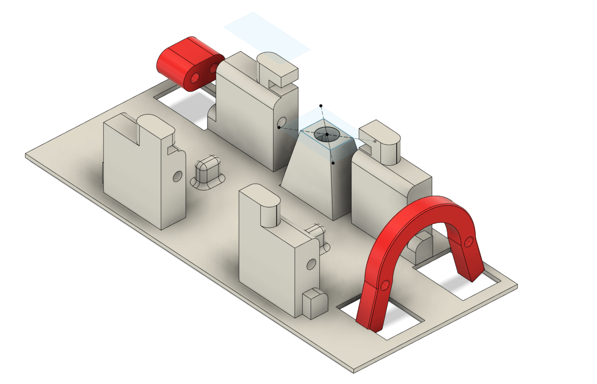

# AC Bot
An ESPHome-based robot to integrate my GE AEL08LQQ2 window AC into Home Assistant.

## Custom PCB

A custom PCB can be found in ./PCB. The expected servo pinout is (Control, 5V, GND),
where Control is indicated on the silkscreen with a solid colored pin.

## BOM

Note: This BOM does not include parts on custom PCB. See the JLCPCB-compatible
[PCB BOM](PCB/jlcpcb/production_files/BOM-esp.csv) for those items, which can
be used to purchase a fully assembled PCB from JLCPCB.

| Part                                                             | Quantity |
| ---------------------------------------------------------------- | -------- |
| SG90 Servo                                                       | 2        |
| M2.5x6 SHCS                                                      | 4        |
| M2x10 self-tapping screws                                        | 5        |
| [~Photoresistor~*](https://www.amazon.com/gp/product/B01N7V536K) | 1        |
| STL/panel.stl, any stiff filament (ABS, PLA, or PETG)            | 1        |
| STL/power-pusher.stl, any stiff filament (ABS, PLA, or PETG)     | 2        |

* The original version of this PCB used a photoresistor to detect the on/off
state of the AC, see below for the flaws of this approach

## 3D Printed Parts

1. Connect all servos the flashed PCB and apply power via USB-C to zero the
servo positions.
2. To each servo, attach power-pusher.stl to the servo horn with a single arm
using M2x10 self-tappers. Use the hole farthest from the center, and third from
the end.
3. Attach servos with M2.5x6 SHCS bolts to panel.stl. Screw directly into the
plastic.
4. Using VHB, or similarly strong double-sided sticky tape, attach directly to
AC's front panel, ensuring alignment with the power, temperature read out, and
temperature control buttons.
5. Apply more force to the front panel to ensure the servos will not push
the printed parts off the front panel.

## Failed Approaches
1. This project originally used a photoresistor to detect when the temperature
readout was lit to infer the on/off state of the air conditioner. This approach
proved unreliable because the outer plastic shell of the airconditioner is
translucent to sunlight, and would provide false indications when the sun
shined directly on the air conditioner's shell.

This was remediated with an [Aqara Smart Plug](https://www.amazon.com/gp/product/B07CJ2MM6Z)
which reports the power consumption in watts.. If the AC is consuming more than
50 watts, it is considered to be on; otherwise, it is considered to be off.

2 . The original version of this project offered the ability to change the
temperature instead of the AC mode (Cool/Energy Save/Fan). After putting v1
into action, I did not use the remote temperature change functionality, but
wanted to change the mode. This functionality was dropped, and the servo was
repurposed to allow changing the mode instead.

## Future Work
1. Change the AC Mode instead of turning off the entire unit when Home
Assistant's thermostat is used.
2. Design a proper mounting mechanism for the PCB, and a cover for the whole
unit
