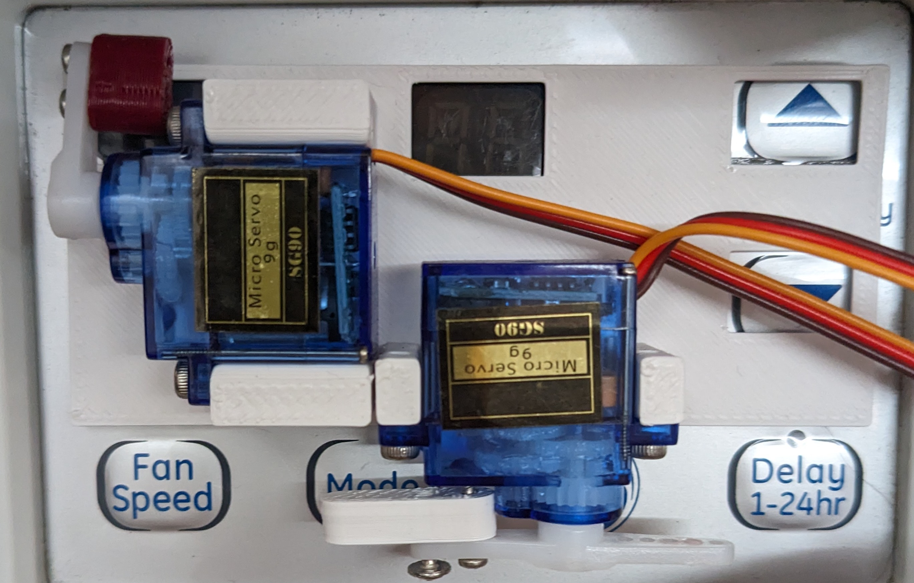

# AC Bot
A small ESPHome-based robot to integrate my old window AC into Home Assistant

## BOM

BOM does not include parts on custom PCB. See [PCB/jlcpcb/production_files/BOM-esp.csv]

| Part | Quantity |
| [Photoresistor](https://www.amazon.com/gp/product/B01N7V536K) | 1
| SG90 Servo | 2 |
| M2.5x6 SHCS | 4 |
| M2x10 tapping screws | 5 |

## Custom PCB

A custom PCB can be found in PCB. The expected servo pinout is (Control, 5V, GND),
where Control is indicated on the silkscreen with a colored in pin.

## 3D Printed Parts

1. Attach power-pusher.stl to the servo horn (arm) on the left servo using self-tapping screws
2. Attach updown-pusher.stl to the servo horn (half circle) on the right servo using self-tapping screws
3. Attach servos with M2.5x6 SHCS screws to panel.stl
4. Insert the photo resistor into photoresistor-guide.stl. Solder to the PCB.
